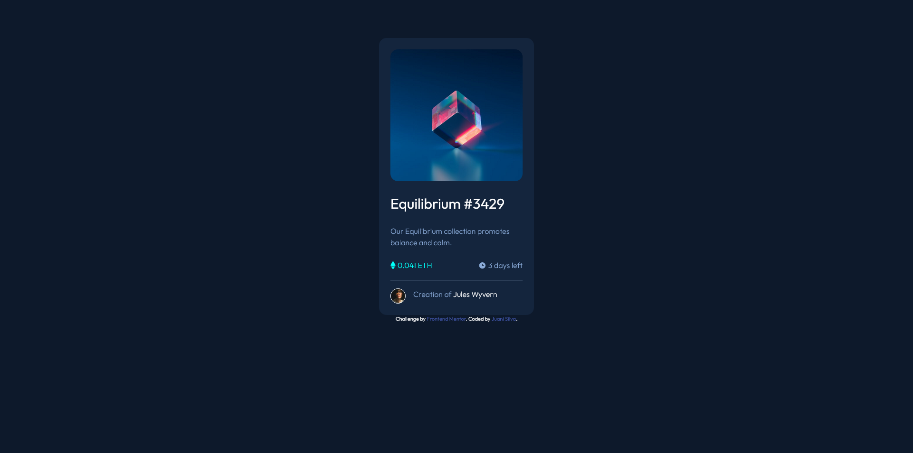

# Frontend Mentor - NFT preview card component solution

This is a solution to the [NFT preview card component challenge on Frontend Mentor](https://www.frontendmentor.io/challenges/nft-preview-card-component-SbdUL_w0U). Frontend Mentor challenges help you improve your coding skills by building realistic projects. 
### The challenge

Users should be able to:

- View the optimal layout depending on their device's screen size
- See hover states for interactive elements

### Screenshot

### Links

- Solution URL: [Add solution URL here](https://github.com/JuaniSilva/NFT-Card-FEM)
- Live Site URL: [Add live site URL here](https://juanisilva.github.io/NFT-Card-FEM/)

## My process
I started with reading the documentation of Tailwind to add it to this project, then, I searched for what ever I didn't know on their quick search tool to add the classes to the elements :D.
### Built with

- Flexbox
- CSS Grid
- Mobile-first workflow
- [Tailwind](https://tailwindcss.com/) - CSS framework

### What I learned

On this project I learend how to implement Tailwind and how to use it on this project
## Author

- Website - [Juani Silva](https://github.com/JuaniSilva)
- Frontend Mentor - [@JuaniSilva](https://www.frontendmentor.io/profile/JuaniSilva)
- Twitter - [@Juani_Silva13](https://twitter.com/Juani_Silva13)

